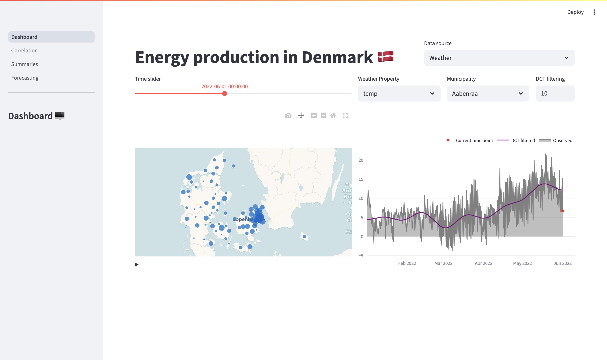
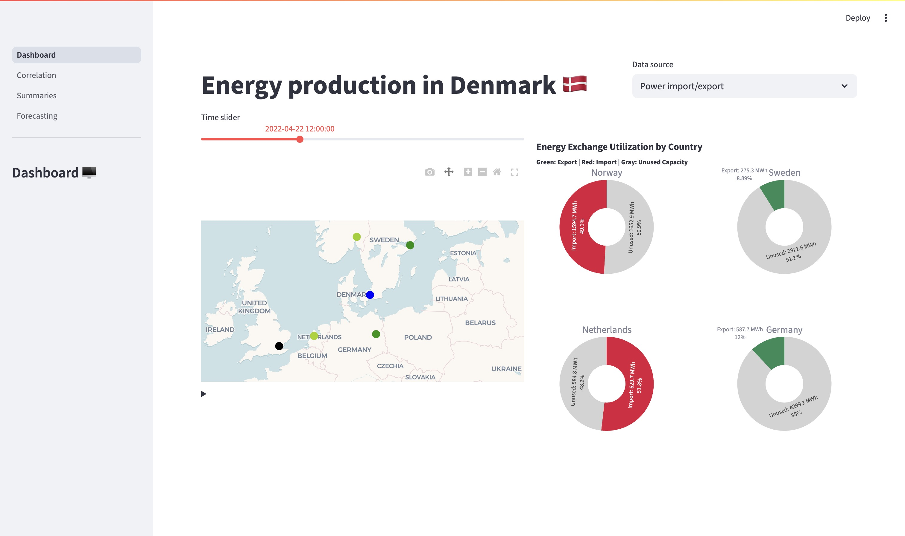
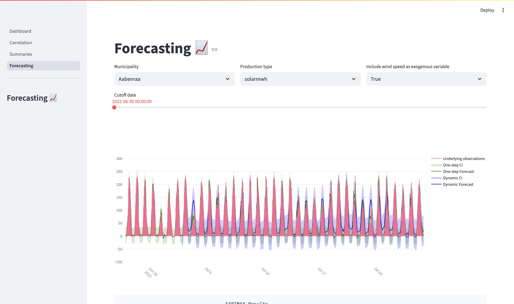
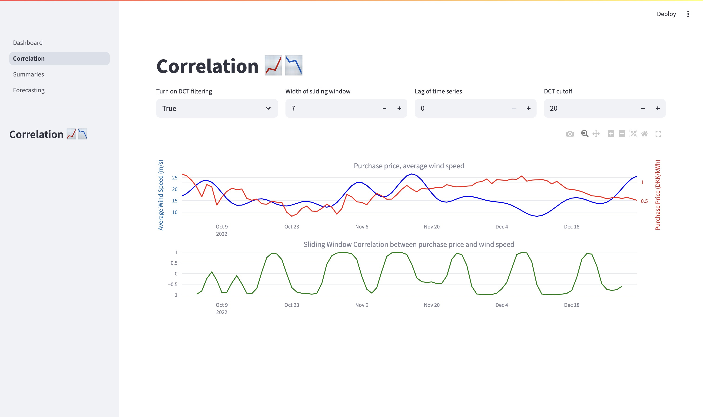
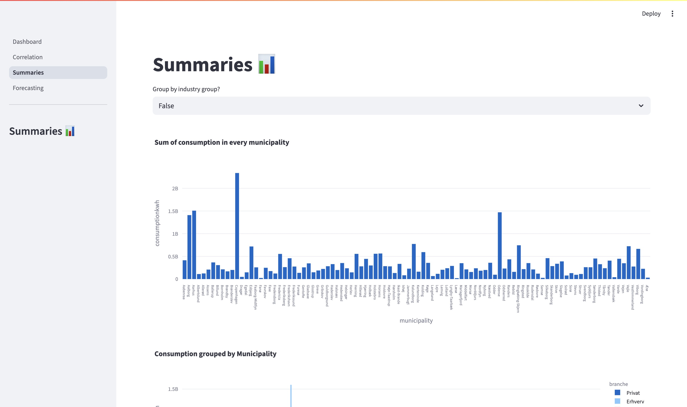
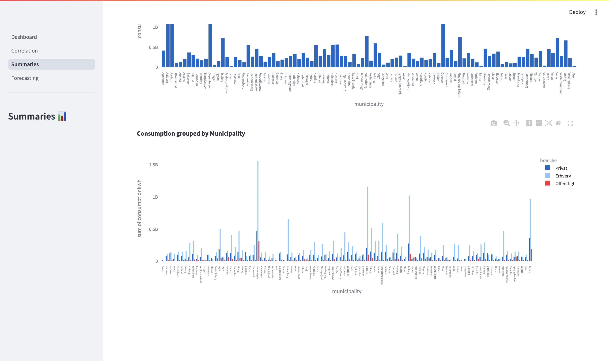

# Energy dashboard (data to decision)

The goal of the project is to create a dashboard with showing various
measurements of electricity production and weather forecast in Denmark in the
period of 2022. Originally, the dashboard was made with the [Writer
Framework](https://dev.writer.com/home/introduction) but I decided to rewrite
the dashboard with [Streamlit](https://streamlit.io/).

The data of electricity production in the dashboard have been acquired through
the API provided by [energidataservice.dk](energidataservice.dk), meanwhile the
weather forecasts have been acquired through
[meteostat](https://meteostat.net/en/)'s Python package. Furthermore, the data
have been stored in an external database with MongoDB and a local Cassandra
database which is managed with PySpark.

## Screenshots of the final dashboard

### Main page

### Forecasting

### Correlation

### Summaries

